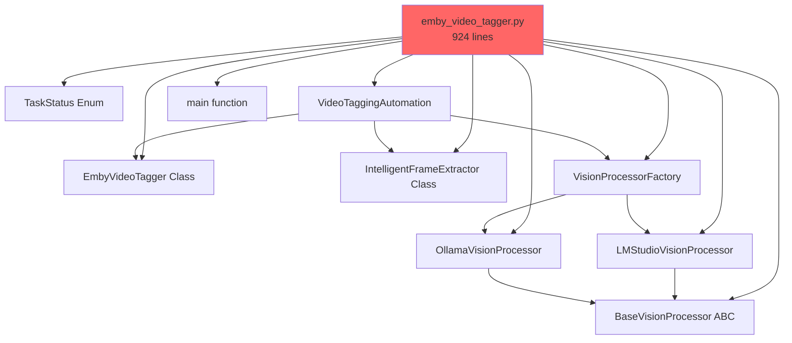
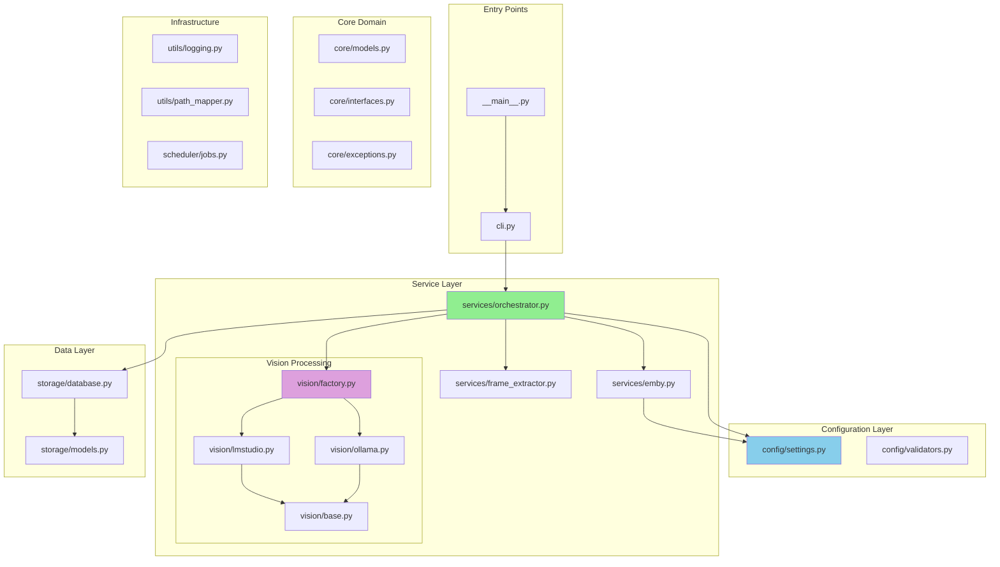
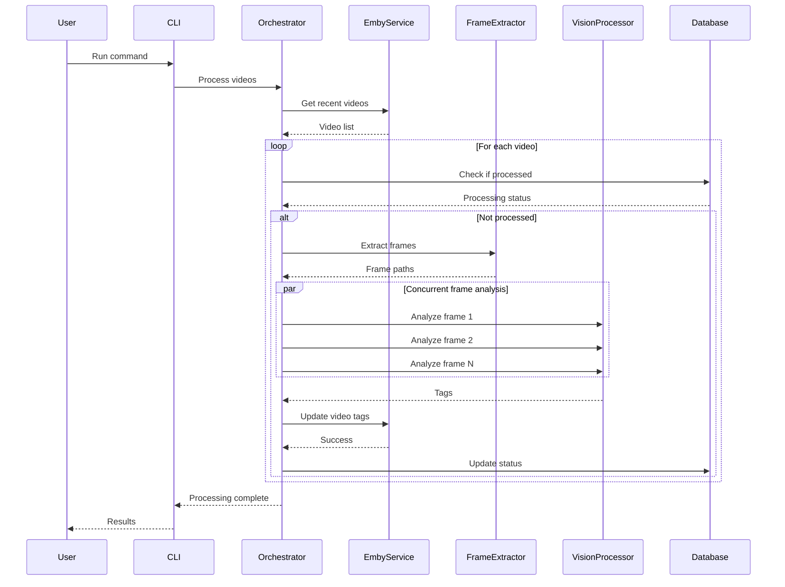
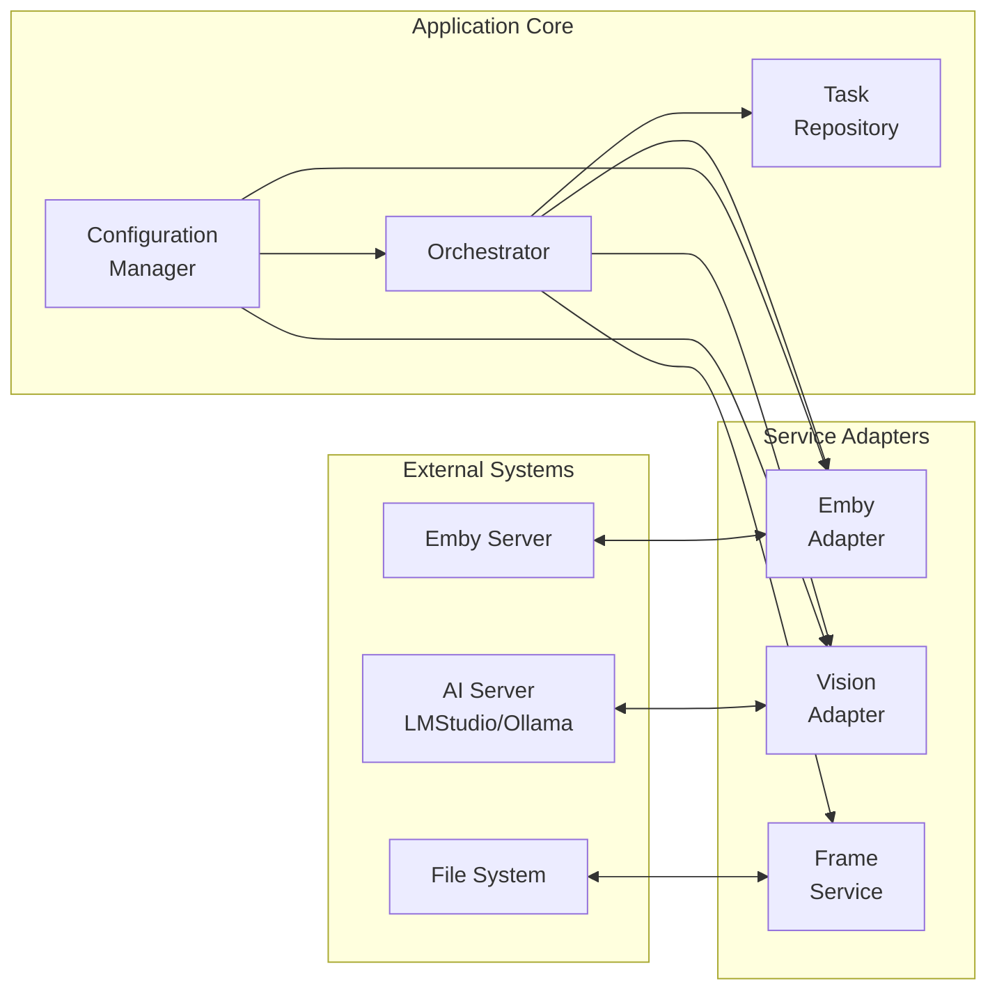
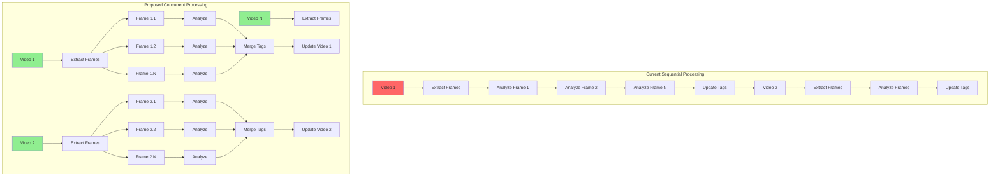

# Emby Video Tagger Architecture Diagrams

## Current Architecture (Monolithic)



## Proposed Architecture (Modular)



## Data Flow Diagram



## Component Interaction Diagram



## Performance Optimization Strategy



## Error Handling Flow

```mermaid
flowchart TD
    START[Start Processing] --> TRY[Try Operation]
    
    TRY --> SUCCESS{Success?}
    SUCCESS -->|Yes| CONTINUE[Continue Processing]
    SUCCESS -->|No| ERROR_TYPE{Error Type?}
    
    ERROR_TYPE -->|Emby API Error| RETRY_API{Retry Count < 3?}
    ERROR_TYPE -->|Frame Extraction Error| FALLBACK[Use Fallback Extraction]
    ERROR_TYPE -->|Vision Processing Error| SKIP_FRAME[Skip Frame]
    ERROR_TYPE -->|Critical Error| LOG_CRITICAL[Log Critical Error]
    
    RETRY_API -->|Yes| BACKOFF[Exponential Backoff]
    RETRY_API -->|No| MARK_FAILED[Mark Video Failed]
    
    BACKOFF --> TRY
    FALLBACK --> CONTINUE
    SKIP_FRAME --> CONTINUE
    LOG_CRITICAL --> MARK_FAILED
    
    MARK_FAILED --> UPDATE_DB[Update Database]
    UPDATE_DB --> NEXT_VIDEO[Process Next Video]
    
    CONTINUE --> COMPLETE{All Done?}
    COMPLETE -->|No| TRY
    COMPLETE -->|Yes| END[End Processing]